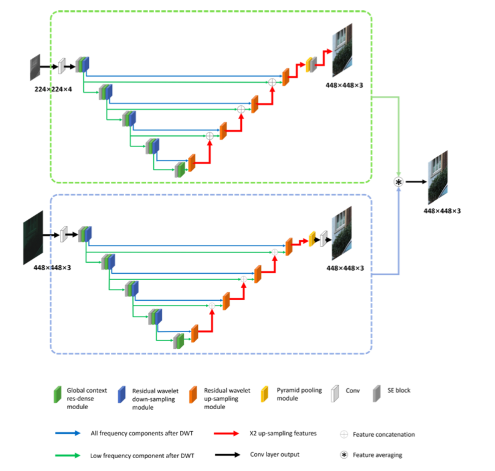

**Authors**: **Linhui Dai**, Xiaohong Liu, Chengqi Li, Jun Chen  
[[PDF](https://arxiv.org/abs/2008.09228)]   [[Code](https://github.com/Charlie0215/AIM2020.git)]

### Abstract
As the revolutionary improvement being made on the performance of smartphones over the last decade, mobile photography becomes one of the most common practices among the majority of smartphone users. However, due to the limited size of camera sensors on phone, the photographed image is still visually distinct to the one taken by the digital single-lens reflex (DSLR) camera. To narrow this performance gap, one is to redesign the camera image signal processor (ISP) to improve the image quality. Owing to the rapid rise of deep learning, recent works resort to the deep convolutional neural network (CNN) to develop a sophisticated data-driven ISP that directly maps the phone-captured image to the DSLR-captured one. In this paper, we introduce a novel network that utilizes the attention mechanism and wavelet transform, dubbed AWNet, to tackle this learnable image ISP problem. By adding the wavelet transform, our proposed method enables us to restore favorable image details from RAW information and achieve a larger receptive field while remaining high efficiency in terms of computational cost. The global context block is adopted in our method to learn the non-local color mapping for the generation of appealing RGB images. More importantly, this block alleviates the influence of image misalignment occurred on the provided dataset. Experimental results indicate the advances of our design in both qualitative and quantitative measurements.

